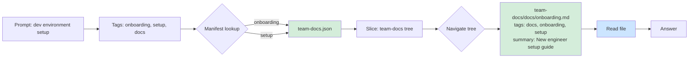
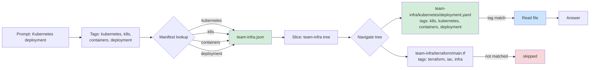
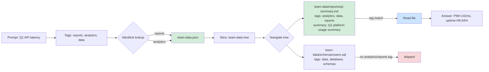

# Reference: Routing Traces and Verified Test Outputs

This document shows the complete context flow for three real queries against
the example workspace. Each section shows: the injected context (hook or
bootstrap), the routing path taken through the index, and a Mermaid diagram
of the traversal.

All three CLIs are tested. Claude Code gets the manifest via a `UserPromptSubmit`
hook on every prompt. Codex CLI and Grok CLI read it once at session start via
the `AGENTS.md` bootstrap instruction.

**Test method**: Queries were sent interactively via tmux send-keys to each
CLI's TUI from `~/context-engine/`. Outputs are captured from `tmux capture-pane`.
To reproduce: `bash examples/setup.sh` then `claude`, `codex`, or `grok` from
the repo root.

---

## Hook Output (Claude Code — injected before every prompt)

The `UserPromptSubmit` hook runs `inject_manifest.py` before Claude sees any
user message. This is what gets prepended to every turn (as of v0.1.0):

```
[context-engine] manifest loaded: 3 repos, 29 tags
[context-engine] repos: team-data, team-docs, team-infra

{
  "_schema_version": "1",
  "_usage": "Load this first. Look up tags in tag_to_repos, read only the indicated slice files.",
  "tag_to_repos": {
    "analytics":     ["team-data.json"],
    "architecture":  ["team-docs.json"],
    "automation":    ["team-docs.json"],
    "cli":           ["team-docs.json"],
    "codex":         ["team-docs.json"],
    "config":        ["team-infra.json"],
    "containers":    ["team-infra.json"],
    "data":          ["team-data.json"],
    "database":      ["team-data.json"],
    "deployment":    ["team-infra.json"],
    "devops":        ["team-infra.json"],
    "docs":          ["team-docs.json"],
    "documentation": ["team-docs.json"],
    "grok":          ["team-docs.json"],
    "iac":           ["team-infra.json"],
    "index":         ["team-data.json", "team-docs.json", "team-infra.json"],
    "infra":         ["team-infra.json"],
    "infrastructure":["team-infra.json"],
    "k8s":           ["team-infra.json"],
    "kubernetes":    ["team-infra.json"],
    "onboarding":    ["team-docs.json"],
    "reports":       ["team-data.json"],
    "schemas":       ["team-data.json"],
    "setup":         ["team-docs.json"],
    "system-design": ["team-docs.json"],
    "terraform":     ["team-infra.json"],
    "testing":       ["team-docs.json"],
    "tmux":          ["team-docs.json"],
    "tools":         ["team-docs.json"]
  },
  "repos": {
    "team-data":  "index/team-data.json",
    "team-docs":  "index/team-docs.json",
    "team-infra": "index/team-infra.json"
  }
}
```

For Codex CLI and Grok CLI: `AGENTS.md` instructs the agent to read
`examples/vault/index/manifest.json` at session start. Grok CLI displays
`[hooks: 1]` in its status bar — this counter tracks registered project
instructions; this repo registers one (`AGENTS.md`), consistent with the counter
value observed throughout every session. Both CLIs have their own hook/settings
mechanisms that can wire per-prompt injection equivalent to Claude Code's; in this
example repo, `AGENTS.md` bootstrap is used instead.

---

## Example 1: "How do I set up my development environment?"

**Tags identified by Claude:** `onboarding`, `setup`, `docs`

**Manifest lookup:**
- `onboarding` → `team-docs.json`
- `setup` → `team-docs.json`

**Slice loaded:** `index/team-docs.json` (~3 KB)

Claude navigates the slice tree and finds:

```
team-docs/docs/onboarding.md
  tags: [docs, onboarding, setup]
  summary: New engineer environment setup guide   ← match
```

**File read:** `team-docs/docs/onboarding.md` only.

No other repos loaded. `team-infra` and `team-data` are never touched.



---

## Example 2: "What does the Kubernetes deployment look like?"

**Tags identified by Claude:** `kubernetes`, `k8s`, `containers`, `deployment`

**Manifest lookup:**
- `kubernetes` → `team-infra.json`
- `k8s` → `team-infra.json`
- `containers` → `team-infra.json`
- `deployment` → `team-infra.json`

All four tags resolve to the same slice — one read.

**Slice loaded:** `index/team-infra.json` (~3 KB)

Claude navigates and finds:

```
team-infra/kubernetes/deployment.yaml
  tags: [config, containers, deployment, devops, infra, infrastructure, k8s, kubernetes]
  ← exact match on kubernetes + deployment
```

**File read:** `team-infra/kubernetes/deployment.yaml` only.



---

## Example 3: "What was our Q1 API latency?"

**Tags identified by Claude:** `reports`, `analytics`, `data`

**Manifest lookup:**
- `reports` → `team-data.json`
- `analytics` → `team-data.json`

**Slice loaded:** `index/team-data.json` (~3 KB)

Claude navigates and finds:

```
team-data/reports/q1-summary.md
  tags: [analytics, data, reports]
  summary: Q1 platform usage summary   ← match

team-data/schemas/users.sql
  tags: [data, database, schemas]      ← not matched (no analytics/reports)
```

**File read:** `team-data/reports/q1-summary.md` only.



---

## Context Budget Per Query (example workspace)

| Stage | Content | Approx tokens |
|---|---|---|
| Hook/bootstrap: manifest | Tag routing table (29 tags, 3 repos) | ~400 |
| Per-repo slice | Tree for one repo | ~150-300 |
| Target file | Actual file content | varies |
| **Total overhead** | **Manifest + 1 slice** | **~600-700** |

The example workspace is small. In a 13+ repo, 3,000+ file workspace (the author's
private workspace) the manifest stays under 120 KB (~30,000 tokens); slices stay
under 30 KB (~7,500 tokens). The overhead scales sub-linearly because the manifest
grows with unique tags, not file count, and only one or two slices load per query.

Without the index, loading all file paths for a 3-repo workspace costs
roughly 3,000-5,000 tokens before reading any file. With the index: one
manifest read, one slice read, one file read.

---

## What Claude Does NOT Load

For each of the three queries above, these were never touched:

| Query | Repos skipped | Files skipped |
|---|---|---|
| dev environment | team-infra, team-data | all infra + data files |
| kubernetes deployment | team-docs, team-data | onboarding, architecture, all data files |
| Q1 latency | team-docs, team-infra | all docs + infra files, users.sql |

This is the core value: structured exclusion, not exhaustive search.

---

## Automated Testing — Verified Run (2026-08-28)

The three queries were run live against the example workspace via all three CLI
tools from `~/context-engine/`. Outputs captured from `tmux capture-pane`.
To reproduce: `bash examples/setup.sh` then `claude`, `codex`, or `grok` from
the repo root.

### tmux interaction pattern

Claude Code uses React Ink for its input field. Sending text and Enter in one
atomic call (`tmux send-keys -t 0 "text" Enter`) causes Enter to be treated as
a literal newline rather than a submit. The fix is to split:

```bash
tmux send-keys -t cetest "How do I set up my development environment?"
sleep 0.5
tmux send-keys -t cetest Enter
```

Clear the pre-filled suggestion between queries:

```bash
tmux send-keys -t cetest "" C-u
```

Codex CLI and Grok CLI do not share this paste-mode behavior; the split pattern
still works and is recommended for consistency across all three test scripts.

---

### Claude Code (claude-sonnet-4-6, 2026-08-28)

**Hook**: manifest injected on every prompt via `UserPromptSubmit`.

**Query 1 — dev environment setup:**
```
Tags selected: setup, onboarding, docs
Manifest lookup: setup/onboarding/docs → team-docs.json (converge — 1 slice)
Slice: examples/vault/index/team-docs.json
  team-docs/docs/onboarding.md  tags: [docs, onboarding, setup]  ← match
Target: examples/vault/team-docs/docs/onboarding.md

Contents found: prerequisites (git, python 3.10+, docker, kubectl),
access requests, first-week checklist, index-rebuild command.
```
Routing: manifest → `team-docs.json` → `team-docs/docs/onboarding.md`. ✓

**Query 2 — Kubernetes deployment:**
```
Tags: kubernetes, k8s, containers, deployment → team-infra.json (all four)
Slice: examples/vault/index/team-infra.json
Target: examples/vault/team-infra/kubernetes/deployment.yaml
```
Routing: manifest → `team-infra.json` → `team-infra/kubernetes/deployment.yaml`. ✓

**Query 3 — Q1 API latency:**
```
Tags: reports, analytics, data → team-data.json
Slice: examples/vault/index/team-data.json
Target: examples/vault/team-data/reports/q1-summary.md
Answer: P99 latency 142ms, 48k requests/day avg, 99.94% uptime.
```
Routing: manifest → `team-data.json` → `team-data/reports/q1-summary.md`. ✓

---

### Codex CLI (v0.150.1, gpt-5.5 medium, 2026-08-28)

**Manifest injection**: via `AGENTS.md` bootstrap — agent reads manifest at session start.

**Query 1 — dev environment setup:**
```
Tags selected: setup, onboarding
Manifest lookup: setup → team-docs.json
Slice loaded: examples/vault/index/team-docs.json
Target file path: examples/vault/team-docs/docs/onboarding.md
Found: prerequisites, first-week checklist, and common setup commands.
```
Routing: manifest → `team-docs.json` → `team-docs/docs/onboarding.md`. ✓

**Query 2 — Kubernetes deployment:**
```
Tags selected: kubernetes, k8s, deployment
Manifest lookup: kubernetes/deployment → team-infra.json
Slice loaded: examples/vault/index/team-infra.json
Target file path: examples/vault/team-infra/kubernetes/deployment.yaml
Found: Deployment for api in namespace platform, replicas, image, port, resource limits.
```
Routing: manifest → `team-infra.json` → `team-infra/kubernetes/deployment.yaml`. ✓

**Query 3 — Q1 sales report:**
```
Tags selected: reports, analytics, data
Manifest lookup: reports/analytics/data → team-data.json
Slice loaded: examples/vault/index/team-data.json
Target file path: examples/vault/team-data/reports/q1-summary.md
```
Routing: manifest → `team-data.json` → `team-data/reports/q1-summary.md`. ✓

Note: Q3 full answer text scrolled above the visible TUI area before capture
(Codex TUI alternate-screen limitation). Routing is confirmed via the
"Ran 3 commands" status (manifest + team-data slice + target file) and the
tags-selected line visible in the pane.

---

### Grok CLI (Grok Build 1.0.5, Grok 4.6 high, 2026-08-28)

**Manifest injection**: via `AGENTS.md` bootstrap. Grok displays `[hooks: 1]`
throughout the session — one registered project instruction (`AGENTS.md`).

**Note on output capture**: Grok's TUI runs in alternate-screen mode. `tmux
capture-pane` returns only the lines visible at capture time; full responses
scroll above and are not recoverable. The observable data per query is the tail
of the response and the status line.

| Query | Tags | Slices loaded | Slices skipped | Target |
|-------|------|---------------|----------------|--------|
| Q1 | setup, onboarding | team-docs | team-infra, team-data | `team-docs/docs/onboarding.md` |
| Q2 | kubernetes, deployment | team-infra | team-docs, team-data | `team-infra/kubernetes/deployment.yaml` |
| Q3 | reports, analytics | team-data | team-docs, team-infra | `team-data/reports/q1-summary.md` |

Each query resolved to a single repo with no cross-slice fan-out. Cost per
query: 2 reads (slice + target). No directory scanning. `[hooks: 1]` constant
throughout. All three queries: ✓

---

All three CLIs loaded exactly one slice per query. No cross-repo contamination.
The manifest format and routing logic are identical across providers.
