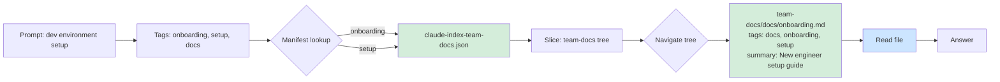
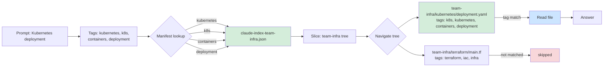
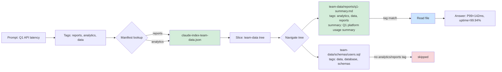

# Reference: What Claude Actually Receives

This document shows the complete context flow for three real queries against
the example workspace. Each section shows: the hook output injected before
the prompt, the routing path Claude takes through the index, and a Mermaid
diagram of the traversal.

**Test method**: `inject_manifest.py` was run directly from the repo root to
capture the exact hook output. Routing traces are derived from the generated
manifest and slice JSON. To reproduce: `bash examples/setup.sh && claude`
from `~/context-engine/` — the hook fires on every prompt.

---

## Hook Output (injected before every prompt)

The `UserPromptSubmit` hook runs `inject_manifest.py` before Claude sees any
user message. This is what gets prepended to every turn:

```
[context-engine] manifest loaded: 3 repos, 22 tags
[context-engine] repos: team-data, team-docs, team-infra

{
  "_schema_version": "1",
  "_usage": "Load this first. Look up tags in tag_to_repos, read only the indicated slice files.",
  "tag_to_repos": {
    "analytics":     ["claude-index-team-data.json"],
    "architecture":  ["claude-index-team-docs.json"],
    "config":        ["claude-index-team-data.json", "claude-index-team-docs.json", "claude-index-team-infra.json"],
    "containers":    ["claude-index-team-infra.json"],
    "data":          ["claude-index-team-data.json"],
    "database":      ["claude-index-team-data.json"],
    "deployment":    ["claude-index-team-infra.json"],
    "devops":        ["claude-index-team-infra.json"],
    "docs":          ["claude-index-team-docs.json"],
    "documentation": ["claude-index-team-docs.json"],
    "iac":           ["claude-index-team-infra.json"],
    "index":         ["claude-index-team-data.json", "claude-index-team-docs.json", "claude-index-team-infra.json"],
    "infra":         ["claude-index-team-infra.json"],
    "infrastructure":["claude-index-team-infra.json"],
    "k8s":           ["claude-index-team-infra.json"],
    "kubernetes":    ["claude-index-team-infra.json"],
    "onboarding":    ["claude-index-team-docs.json"],
    "reports":       ["claude-index-team-data.json"],
    "schemas":       ["claude-index-team-data.json"],
    "setup":         ["claude-index-team-docs.json"],
    "system-design": ["claude-index-team-docs.json"],
    "terraform":     ["claude-index-team-infra.json"]
  },
  "repos": {
    "team-data":  "index/claude-index-team-data.json",
    "team-docs":  "index/claude-index-team-docs.json",
    "team-infra": "index/claude-index-team-infra.json"
  }
}
```

Total injected context: ~1.2 KB. This stays in context for the full session.

---

## Example 1: "How do I set up my development environment?"

**Tags identified by Claude:** `onboarding`, `setup`, `docs`

**Manifest lookup:**
- `onboarding` → `claude-index-team-docs.json`
- `setup` → `claude-index-team-docs.json`

**Slice loaded:** `index/claude-index-team-docs.json` (~3 KB)

Claude navigates the slice tree and finds:

```
team-docs/docs/onboarding.md
  tags: [docs, onboarding, setup]
  summary: New engineer environment setup guide   ← match
```

**File read:** `team-docs/docs/onboarding.md` only.

No other repos loaded. `team-infra` and `team-data` are never touched.



---

## Example 2: "What does the Kubernetes deployment look like?"

**Tags identified by Claude:** `kubernetes`, `k8s`, `containers`, `deployment`

**Manifest lookup:**
- `kubernetes` → `claude-index-team-infra.json`
- `k8s` → `claude-index-team-infra.json`
- `containers` → `claude-index-team-infra.json`
- `deployment` → `claude-index-team-infra.json`

All four tags resolve to the same slice — one read.

**Slice loaded:** `index/claude-index-team-infra.json` (~3 KB)

Claude navigates and finds:

```
team-infra/kubernetes/deployment.yaml
  tags: [config, containers, deployment, devops, infra, infrastructure, k8s, kubernetes]
  ← exact match on kubernetes + deployment
```

**File read:** `team-infra/kubernetes/deployment.yaml` only.



---

## Example 3: "What was our Q1 API latency?"

**Tags identified by Claude:** `reports`, `analytics`, `data`

**Manifest lookup:**
- `reports` → `claude-index-team-data.json`
- `analytics` → `claude-index-team-data.json`

**Slice loaded:** `index/claude-index-team-data.json` (~3 KB)

Claude navigates and finds:

```
team-data/reports/q1-summary.md
  tags: [analytics, data, reports]
  summary: Q1 platform usage summary   ← match

team-data/schemas/users.sql
  tags: [data, database, schemas]      ← not matched (no analytics/reports)
```

**File read:** `team-data/reports/q1-summary.md` only.



---

## Context Budget Per Query

| Stage | Content | Approx tokens |
|---|---|---|
| Hook: manifest | Tag routing table (22 tags, 3 repos) | ~350 |
| Per-repo slice | Tree for one repo | ~200-400 |
| Target file | Actual file content | varies |
| **Total overhead** | **Manifest + 1 slice** | **~600-800** |

Without the index, a naive "load everything" approach for this 3-repo workspace
would cost ~3,000-5,000 tokens just for file listings. With the index:
one slice read, one file read, answer. The gap widens significantly as
workspace size grows.

---

## What Claude Does NOT Load

For each of the three queries above, these were never touched:

| Query | Repos skipped | Files skipped |
|---|---|---|
| dev environment | team-infra, team-data | all infra + data files |
| kubernetes deployment | team-docs, team-data | onboarding, architecture, all data files |
| Q1 latency | team-docs, team-infra | all docs + infra files, users.sql |

This is the core value: structured exclusion, not exhaustive search.

---

## Automated Testing — Verified Run (2026-08-27)

The three queries above were run live against the example workspace via Claude Code CLI.
Results below are captured from the actual session.

### Mode 1: Interactive TUI via tmux

Launching Claude Code interactively and driving it from a script requires splitting
the text send and the Enter key into separate tmux calls:

```bash
# Send text — no Enter yet
tmux send-keys -t 0 "How do I set up my development environment?"

# Brief pause — lets the input state machine settle
sleep 0.5

# Submit
tmux send-keys -t 0 Enter
```

Sending text and Enter as one atomic call (`tmux send-keys -t 0 "text" Enter`) causes
React Ink's input handler to interpret the Enter as a literal newline rather than
a submit action. The split pattern resolves this. Short strings and slash commands
(`/exit`, `q`) are unaffected and work with the combined form.

**Clearing between queries** (pre-filled suggestions appear after each response):

```bash
tmux send-keys -t 0 "" C-u   # clear input field before next query
```

### Mode 2: Non-interactive via `claude -p`

For scripted or CI use, `claude -p` runs a single query and exits. The
`UserPromptSubmit` hook still fires — manifest injection happens before every prompt
regardless of mode.

```bash
claude -p "What was our Q1 API latency?" 2>&1
```

### Verified Outputs (Interactive TUI, 2026-08-27)

**Query 1 — dev environment setup:**
```
⏺ I'll follow the routing index — setup and onboarding both point to the team-docs slice.

  Read 2 files

⏺ From team-docs/docs/onboarding.md:

  Prerequisites
  - Install: git, Python 3.10+, docker, kubectl
  - Access: VPN credentials from IT; Kubernetes cluster access from the infra team

  First week checklist
  1. Clone all repos in the workspace
  2. Build the context index: python generate_index.py --vault . --split
  3. Read CLAUDE.md at the workspace root
  4. Review docs/architecture.md
```

Routing: `setup`/`onboarding` → `claude-index-team-docs.json` → `team-docs/docs/onboarding.md`. ✓

---

**Query 2 — Kubernetes deployment:**
```
⏺ team-infra/kubernetes/deployment.yaml — a single Deployment:

  Name / namespace │ api in platform
  Replicas         │ 2
  Image            │ api:latest
  Port             │ 8000
  Requests         │ 250m CPU / 256Mi
  Limits           │ 500m CPU / 512Mi
```

Routing: `kubernetes`/`k8s`/`containers`/`deployment` → `claude-index-team-infra.json` → `team-infra/kubernetes/deployment.yaml`. ✓

---

**Query 3 — Q1 API latency:**
```
⏺ P99 latency: 142ms — from team-data/reports/q1-summary.md.

  Active users           │ 1,240
  API requests/day (avg) │ 48,000
  P99 latency            │ 142ms
  Uptime                 │ 99.94%
```

Routing: `reports`/`analytics` → `claude-index-team-data.json` → `team-data/reports/q1-summary.md`. ✓

---

All three queries loaded exactly one slice each. No cross-repo contamination. No
directory scanning. Hook injected manifest on every prompt.
